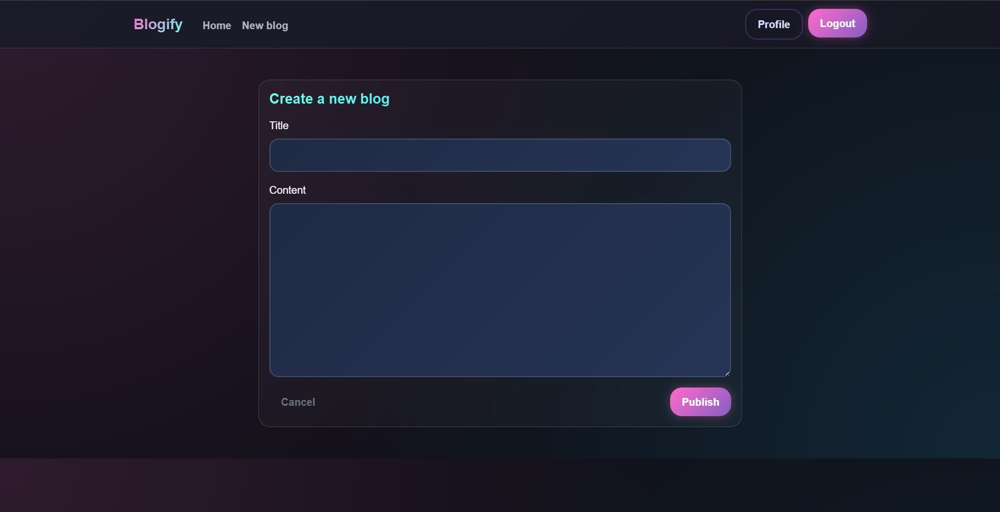
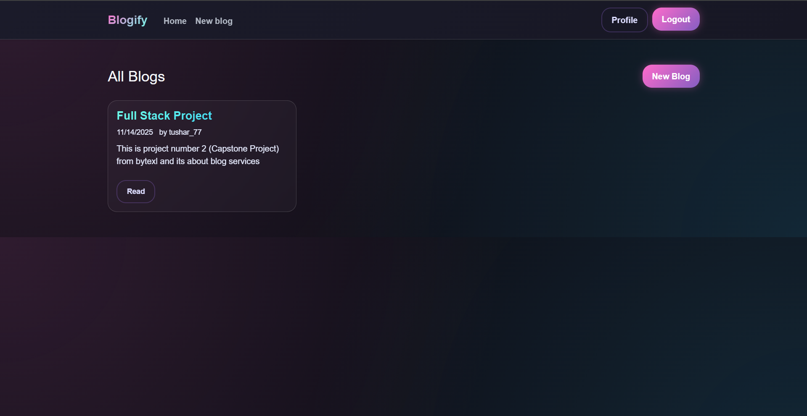
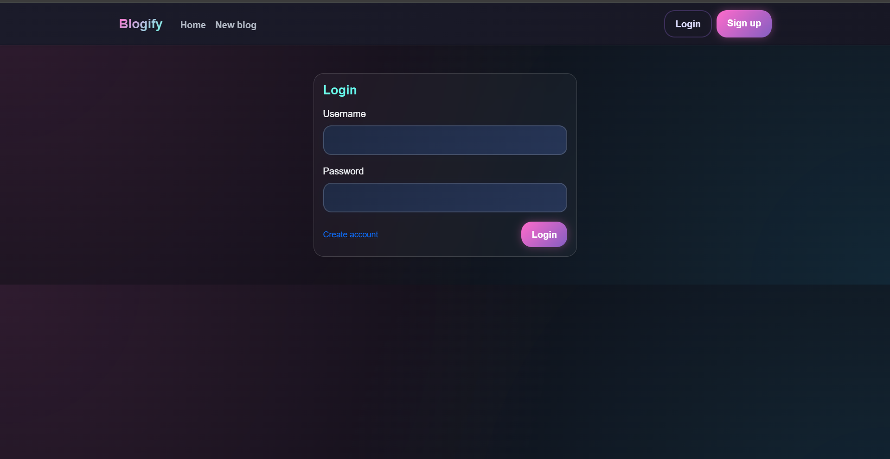
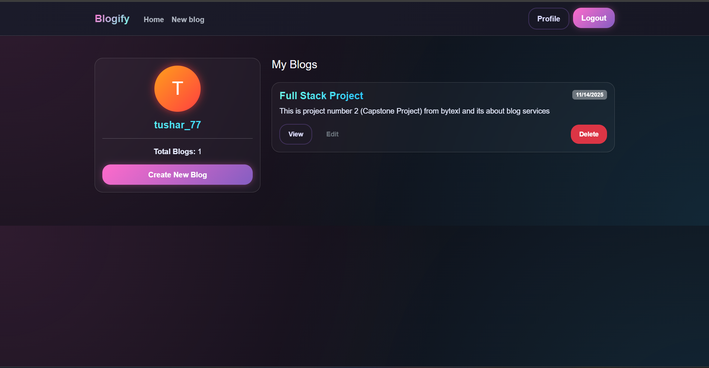
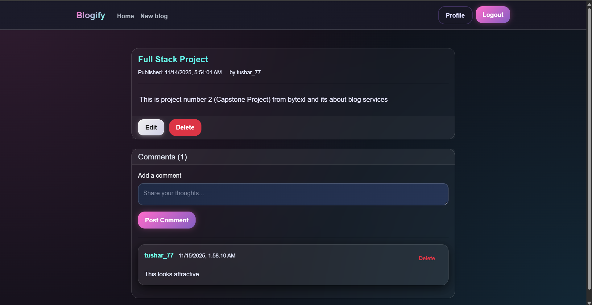
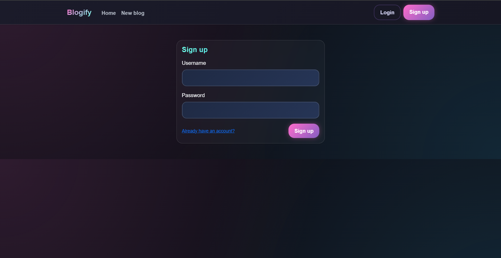

## 🚀 Blogify — Full-Stack Blogging Platform  
*A complete blogging system featuring authentication, CRUD operations, profiles, and an interactive comments module.*

---

## 🏆 GitHub Badges

---

## 📘 Table of Contents
- [Introduction](#introduction)
- [Key Features](#key-features)
- [System Design Overview](#system-design-overview)
- [Architecture Diagram](#architecture-diagram)
- [Sequence Diagram](#sequence-diagram)
- [Database Schema](#database-schema)
- [Folder Structure](#folder-structure)
- [Setup Instructions](#setup-instructions)
- [Screenshots](#screenshots)
- [Future Enhancements](#future-enhancements)
- [Author](#author)

---

## 🧩 Introduction

**Blogify** is a full-stack, session-authenticated blogging platform built using **Node.js**, **Express**, **MongoDB**, **Passport.js**, and **EJS**.  
Users can register, create blogs, leave comments, manage profiles, and interact inside a secure and responsive system.

The UI incorporates:
- Neon gradient effects  
- Modern glass-morphism cards  
- Metallic navy-blue form design  
- Fully responsive layouts for all screens  

The project demonstrates mastery over **backend logic**, **authentication**, **database design**, **frontend templating**, and **web security practices**.

---

## ⭐ Key Features

# 📖 Blog Management

Create & Edit – Users can publish blogs and update them anytime using a clean editor.
Delete – Authors can delete only their own posts, ensuring full ownership.
View All Posts – All blogs appear in a modern, responsive grid layout.
Dedicated Blog Page – Each blog has its own screen with full content, author info, and timestamps.
Safe Routing – Invalid IDs are handled gracefully with redirects and flash messages.

# 👤 User Authentication & Profiles

Sign Up – Register using a unique username + secure password.
Login/Logout – Protected session-based authentication with Passport.js.
Personal Dashboard – Each user gets a profile listing all blogs they’ve created.
Dynamic Navbar – Buttons change automatically based on login state.

# 💬 Comments System

Add Comments – Users can comment on any blog to share thoughts.
Delete Comments – Comment owners can delete their own comments.
Full Moderation – Blog owners can delete anyone’s comments on their posts.
Author Visibility – Comments clearly show who wrote them and when.
Clean UI – Comments appear with neon-styled cards and smooth shadows.

# 🔐 Security & Validation

Password Hashing – Complete security with passport-local-mongoose.
Session Protection – express-session manages secure cookie-based sessions.
Input Validation – Joi validator ensures structured data.
MongoDB Injection Protection – ObjectId validation prevents malicious requests.
Authorization Checks – Only owners can edit/delete their own blogs or comments.
Error Handling – All routes gracefully handle unexpected server issues.

# 🎨 UI / UX Design

Neon-glass Interface
Glass cards with blur, shadows, and gradient borders
Responsive for all screens (mobile, tablet, desktop)
Flash messages for instant user feedback
Smooth animations & hover glow effects
Metallic navy blue input fields

# 🛠 Tech Stack
🔧 Backend

Node.js
Express.js
MongoDB
Mongoose ORM

🔐 Authentication

Passport.js
passport-local
passport-local-mongoose

🎨 Frontend / UI

EJS
ejs-mate
Bootstrap 5
Custom CSS (Neon + Glassmorphism UI)

🛡 Utilities & Validation

Joi
express-session
connect-flash
method-override
dotenv

# 🧠 System Design Overview
Client (EJS Views)
     ↓
Express Routers
     ↓
Middleware (Auth, Validation, Ownership)
     ↓
Mongoose Models
     ↓
MongoDB Database

Follows MVC-inspired modular structure:

Organized routes
Reusable layouts
Dedicated middlewares
Clean, maintainable models

# 🏗 Architecture Diagram
flowchart TD

A[Client Browser] --> B[Express.js Backend]

B --> C[User Routes & Auth]
B --> D[Blog Routes]
B --> E[Comment Logic]

C --> F[(MongoDB - Users)]
D --> G[(MongoDB - Blogs)]
E --> G

style B fill:#1f2a44,stroke:#6fffe9,stroke-width:2px
style F fill:#0f0f17,stroke:#28c6ff
style G fill:#0f0f17,stroke:#28c6ff

# 🔄 Sequence Diagram (Login Flow)
sequenceDiagram
User ->> Server: Enter username + password
Server ->> Passport.js: Validate
Passport.js ->> MongoDB: Find user
MongoDB -->> Passport.js: Return user details
Passport.js -->> Server: Authentication passed
Server -->> User: Logged in + Redirect to /blogs

# 🗄 Database Schema
👤 Users
{
  "username": "String",
  "email": "String",
  "password": "Hashed",
  "blogs": ["ObjectId"]
}

📝 Blogs
{
  "title": "String",
  "content": "String",
  "owner": "ObjectId",
  "comments": [
    {
      "text": "String",
      "author": "ObjectId",
      "createdAt": "Date"
    }
  ]
}

# 📂 Folder Structure
blogify/
│
├── models/
│   ├── blog.js
│   └── user.js
│
├── routes/
│   ├── blogs.js
│   └── user.js
│
├── views/
│   ├── layouts/
│   ├── users/
│   ├── add.ejs
│   ├── edit.ejs
│   ├── index.ejs
│   └── show.ejs
│
├── public/
│   └── style.css
│
├── middlewares.js
├── models.js
├── app.js
├── package.json
└── README.md

# ⚙️ Setup Instructions

1️⃣ Install dependencies
npm install

2️⃣ Create .env
MONGODB_URI=mongodb://localhost:27017/blogify
SESSION_SECRET=your_secret_key

3️⃣ Start MongoDB
mongod

4️⃣ Run the server
node app.js

5️⃣ Open in browser
http://localhost:8080/

# 🖼 Screenshots 

Display in README:

# 🔮 Future Enhancements

Phase 1

JWT authentication
Public REST API

Phase 2

Microservices (Users, Blogs, Comments)
API Gateway
Docker + NGINX

Phase 3

Real-time comments (Socket.io)
Image upload support
Blog reactions (likes, emojis)
Rich-text editor (Quill / CKEditor)

# 👤 Author

Tushar Malik
B.E. CSE (Artificial Intelligence & Machine Learning)
Apex Institute of Technology, Chandigarh University

# 📝 License

This project is intended for academic & personal learning purposes.